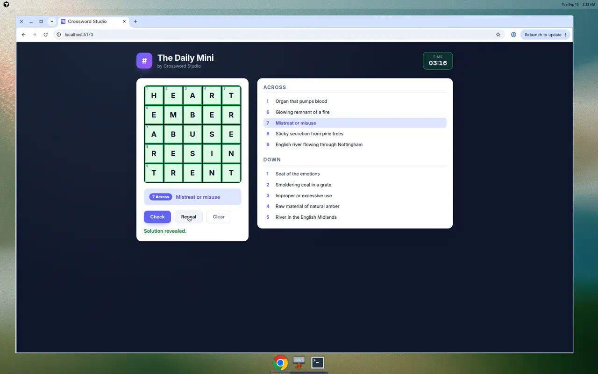

# Crossword

A modern, interactive crossword puzzle you can solve in the browser. It ships as
a small monorepo with two workspaces:

- **`server/`** — an [Express](https://expressjs.com/) + TypeScript API that
  serves puzzles, grades answers, and can reveal the solution.
- **`client/`** — a [React](https://react.dev/) + [Vite](https://vitejs.dev/) +
  TypeScript single-page app that renders the grid and clues, and lets you play
  with full keyboard support.

<p align="center">
  
</p>

## Features

- 5×5 "double word square" mini puzzle where every row and column is a real word.
- Click a cell to select it; click again to toggle between Across and Down.
- Keyboard play: type letters, `Backspace`/`Delete` to erase, arrow keys to move,
  and `Space` to switch direction.
- **Check** grades your grid on the server and colours correct/incorrect cells.
- **Reveal** fills in the solution, and **Clear** resets the board.
- Live timer that stops when the puzzle is solved.

## Prerequisites

- Node.js `>= 20` (developed against Node 22) and npm.

## Getting started

```bash
npm install       # install all workspace dependencies
npm run dev       # start the API (:3001) and the client (:5173) together
```

Then open <http://localhost:5173>. The Vite dev server proxies `/api/*` calls to
the API on port `3001`, so you only need the one URL.

## Available scripts (run from the repo root)

| Command             | Description                                              |
| ------------------- | -------------------------------------------------------- |
| `npm run dev`       | Run the server and client together (hot reload).         |
| `npm run build`     | Type-check and build both workspaces for production.     |
| `npm start`         | Serve the built API (`server/dist`).                     |
| `npm run typecheck` | Type-check both workspaces with `tsc`.                   |
| `npm test`          | Run the server (Vitest + Supertest) and client tests.    |
| `npm run lint`      | Lint the whole repo with ESLint.                         |

## API

| Method & path         | Description                                                       |
| --------------------- | ---------------------------------------------------------------- |
| `GET /api/health`     | Health check.                                                    |
| `GET /api/puzzle`     | The default puzzle (grid layout, numbering, and clues only).     |
| `GET /api/puzzle/:id` | A puzzle by id.                                                  |
| `GET /api/reveal/:id` | The full solution grid (used by the client's **Reveal** button). |
| `POST /api/check`     | Grade `{ puzzleId, answers }`; returns per-cell correctness.     |

The `GET /api/puzzle` response never includes the solution — answers stay on the
server and are only compared during `POST /api/check`.

## Project layout

```
.
├── client/            # React + Vite frontend
│   └── src/
│       ├── components/ # Grid and clue-list components
│       ├── crossword.ts # Pure grid/navigation helpers
│       ├── useCrossword.ts # State + interaction hook
│       └── api.ts     # Typed API client
├── server/            # Express API
│   └── src/
│       ├── app.ts     # Route definitions
│       ├── puzzles.ts # Puzzle data + numbering
│       └── grade.ts   # Answer grading logic
└── .cursor/environment.json # Cloud Agent dev environment
```

## Cloud Agent environment

`.cursor/environment.json` configures the Cursor Cloud Agent environment: it runs
`npm ci` to install dependencies and launches `npm run dev` in a terminal,
exposing ports `5173` (client) and `3001` (server).
